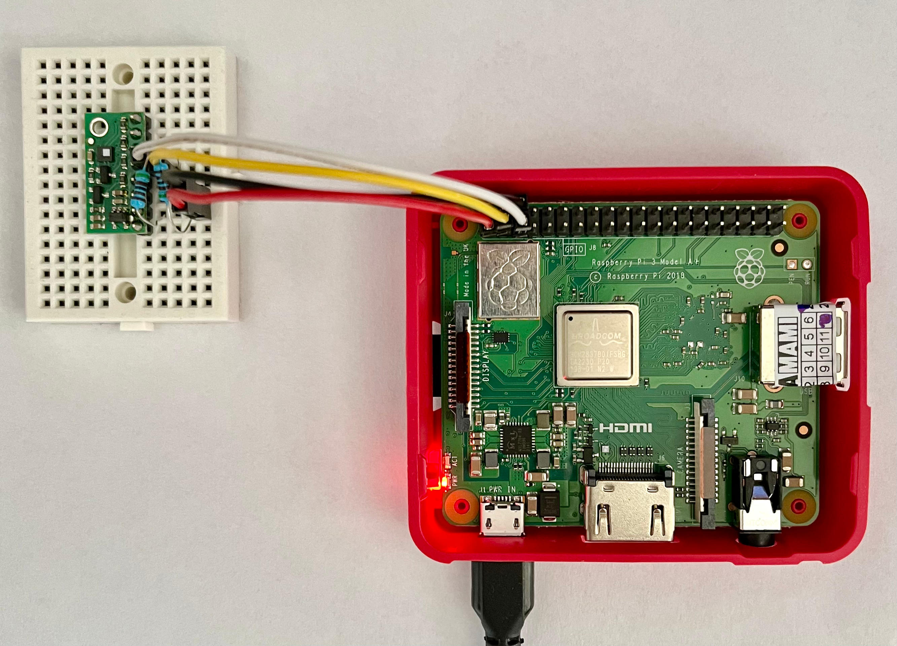

# Linux driver for LPS25HB pressure sensor
This repository contains Linux kernel driver for LPS25HB digital barometer.  
Overview:
* Supports both blocking and non blocking pressure reads (via poll)
* Device Tree support
* Uses I2C  
* Tested on BeagleBone Black Rev. C and Raspberry Pi 3A+. Additional device tree definitions must be provided when using different platforms.
* Buildroot support

## Usage
Pressure can be obtained by reading `/dev/barometerX` (where X is the device number), the read value is pressure in hPa. The file descriptor can be used with epoll/poll/select interfaces.
 
The last pressure readout from the device is considered valid for 500 ms. Following reads within this timespan will return the cached value.  This timespan can be changed by writing new value to `/sys/class/lps25hb/barometerX/data_stale_time_ms`. Current value can be obtained by reading this file.
  

## Building the driver
Following steps show how to build the driver on target system, RPi 3A+ has been used as an example:
* Run `make` in the cloned repository to build the driver kernel module
* Build device tree overlay: `dtc -@ -I dts -O dtb -o pi3a.dtbo dt/pi3a.dts`
* Load the overlay: `sudo dtoverlay pi3a.dtbo`
* Load the module: `sudo insmod lps25hb_mod.ko`

Required packages: `linux-headers`, `build-essential`, `device-tree-compiler`
